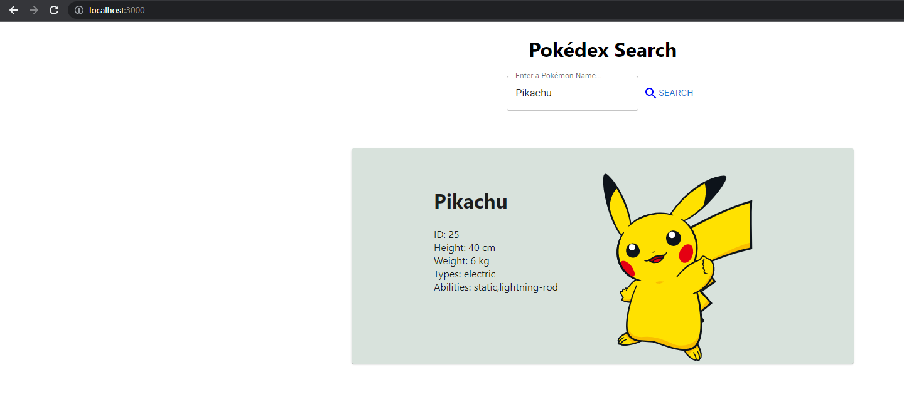
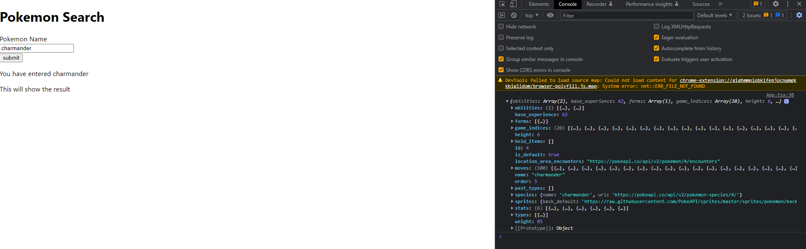
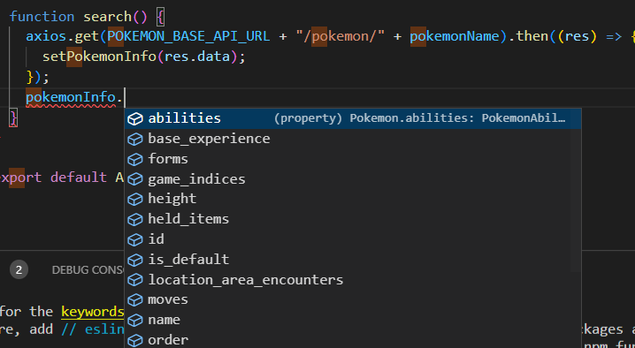

# NZMSA Phase 2 Frontend 

Welcome to the frontend section of NZMSA Phase 2. This module assumes you have the basic knowledge of HTML & CSS, JavaScript, TypeScript, React and Git, as the training was provided in 2022-Phase-1 through Microsoft Learn. Don't worry if you don't feel super confident in all of these tech, we'll guide you through it the things you'll need in phase 2. You can refer to the Phase 1 repo here: [https://github.com/NZMSA/2022-Phase-1](https://github.com/NZMSA/2022-Phase-1)

Table of Content
- [NZMSA Phase 2 Frontend](#nzmsa-phase-2-frontend)
- [Overview](#overview)
  * [What you'll need](#what-you-ll-need)
- [Step 0 - Getting Started with React](#step-0---getting-started-with-react)
- [Step 1 - Start Coding](#step-1---start-coding)
- [Step 2 - Building to basic UI to take user input](#step-2---building-to-basic-ui-to-take-user-input)
- [Step 3 - Making an API call](#step-3---making-an-api-call)
- [Step 4 - Displaying the retrieved information.](#step-4---displaying-the-retrieved-information)
- [Step 5 - TypeScript Interface definition](#step-5---typescript-interface-definition)
- [Step 6 - Adding Material UI](#step-6---adding-material-ui)
- [Step 7 - Styling everything up!](#step-7---styling-everything-up)
- [Phase 2 Assignment - Frontend](#phase-2-assignment---frontend)


# Overview
The goal of this module is to create a React TypeScript application with custom UI and display information from a third party API. 

## What you'll need
* [NodeJS 16.16.0 LTS](https://nodejs.org/en/) Other versions may work, however, there may be some variants between versions. 
* [Visual Studio Code](https://code.visualstudio.com/download) with 
* [Git](https://git-scm.com/)
* [GitHub account](https://github.com/)

This module will describe the process of building a very simple Pokédex search website. Below is what the end product looks like. It will involve basic HTML, TypeScript, API call and Material UI. There may be a lot of content for beginners, please take your time to digest each step to ensure your understanding. 



# Step 0 - Getting Started with React
In your working directory, let start a new React with TypeScript project

* In a terminal, invoke the command from a terminal: `npx create-react-app my-app --template typescript --use-npm`
> "--template typescript" tells create react app to use the typescript template for the react project.
* Follow through the command prompt in order to create a new React app. Follow through the output of the file

At this point, your project layout should look like the following:

```text
my-app/
├─ .git/
├─ node_modules/
├─ public/
├─ src/
│  └─ ...
├─ .gitignore
├─ package.json
├─ tsconfig.json
└─ package-lock.json
```

Of note:

* `tsconfig.json` contains TypeScript-specific options for our project.
* `package.json` contains our dependencies, as well as some shortcuts for commands we'd like to run for testing, previewing, and deploying our app.
* `public` contains static assets like the HTML page we're planning to deploy to, or images. You can delete any file in this folder apart from `index.html`.
* `src` contains our TypeScript and CSS code. `index.tsx` is the entry-point for our file, and is mandatory.

Every time you save a change to your application it should be automatically rebuilt. This helps us by allowing us to quickly see changes and therefore iterate on a more frequent basis.

After you've run the project for the first time you should be greeted with the following screen.


# Step 1 - Start Coding

Before we begin lets go ahead and remove the code that we will not be using which is provided to us by the create react app template. Specifically in the `App.tsx` file in the src folder lets remove the lines within App function till we are left with the following.

```tsx
import React from 'react';
import './App.css';

function App() {
  return (
    <div>
        <p>
            Hello, world
        </p>
    </div>
  );
}

export default App;
```

# Step 2 - Building to basic UI to take user input
This step will go through how to take input from the user and display the result back to the user. 

In the same `App.tsx` file, declare a new state variable called `pokemonName`. 
```tsx
const [pokemonName, setPokemonName] = useState("");
```
This should go above the return statement. A state variable is a very useful concept in React to responsible for updating the web page. You can read more about it here [https://reactjs.org/docs/hooks-state.html](https://reactjs.org/docs/hooks-state.html).

Next, we want to take input from the user and display it back to them. To do this, you'll need to use a combination of HTML and JavaScript in the return statement. 

Instead of returning a div saying hello world, we'll take input from the user and display it back to them. 
```tsx
import { useState } from 'react';
import './App.css';

function App() {
  // Declare a new state variable, which we'll call "pokemonName"
  const [pokemonName, setPokemonName] = useState("");

  return (
    <div>
      <h1>
        Pokemon Search
      </h1>
      
      <div>
        <label>Pokemon Name</label><br/>
        <input type="text" id="pokemon-name" name="pokemon-name" onChange={e => setPokemonName(e.target.value)}/><br/>
        <button onClick={search}>
        Search
        </button>
      </div>

      <p>
        You have entered {pokemonName}
      </p>
    </div>
  );

  function search(){
      alert("Search button has been clicked!");
  }
}

export default App;
```

Save the changes you have made in `App.tsx` so far, refresh the react web page and play around with what you have just created!

# Step 3 - Making an API call
So far, we've been taking input from the user and display it right back to them, that's not really useful 😳 

In this section, we will take the input from the user, look up infomration online via an web API (application programming interface), and display the information we found to the user. 

We will utilize the Web API available on [https://pokeapi.co/](https://pokeapi.co/), please take a few minutes to explore the website to discover what it offers. 

To start, we will need to install an NPM module called Axios. An NPM module is an existing library that reduces the amount of work you have to do for a general task. You can utilize NPM modules to achieve a specific purpose for your project. [Axios](https://github.com/axios/axios) module in particular helps us to make simple HTTP calls to retrieve web information. 

* Open a new terminal in the folder of your project, and type in `npm install axios`

The output of the command should look like so:
```
>npm install axios

added 8 packages, and audited 9 packages in 2s

1 package is looking for funding
  run `npm fund` for details

found 0 vulnerabilities
```

We'll now use this newly installed module in our `App.tsx`.
```tsx
import axios from "axios";
import { useState } from "react";
import "./App.css";

function App() {
  // Declare a new state variable, which we'll call "pokemonName"
  const [pokemonName, setPokemonName] = useState("");

  const POKEMON_BASE_URL = "https://pokeapi.co/api/v2";
  return (
    <div>
      <h1>Pokemon Search</h1>

      <div>
        <label>Pokemon Name</label>
        <br />
        <input
          type="text"
          id="pokemon-name"
          name="pokemon-name"
          onChange={(e) => setPokemonName(e.target.value)}
        />
        <br />
        <button onClick={search}>Search</button>
      </div>

      <p>You have entered {pokemonName}</p>

      <div id="pokemon-result">This will show the result</div>
    </div>
  );

  function search() {
    axios.get(POKEMON_BASE_URL + "/pokemon/" + pokemonName).then((res) => {
      console.log(res.data);
    });
  }
}

export default App;
```
Comparing this code from the previous version, we have added the Axios module to the app by calling `import axios from 'axios'`. We have also defined a base url for the API and uses the user inputted information to make a web request and print to the console. 

Save this file and refresh the browser, bring up the `developer console` by pressing F12, or right click on the web page then select inspect element. Select the Console tab from the Developer Console. 

Then use the input field to enter the name of a Pokemon then press Search. You should see a new log in the console, expand that the explore the information (formatted in JSON) that the API just returned!



# Step 4 - Displaying the retrieved information. 

Now that we have the information available, we'll want to display some of the information back to the user. 
```tsx
import axios from "axios";
import { useState } from "react";
import "./App.css";

function App() {
  // Declare a new state variable, which we'll call "pokemonName"
  const [pokemonName, setPokemonName] = useState("");
  const [pokemonInfo, setPokemonInfo] = useState<undefined | any>(undefined);

  const POKEMON_BASE_API_URL = "https://pokeapi.co/api/v2";
  return (
    <div>
      <h1>Pokemon Search</h1>

      <div>
        <label>Pokemon Name</label>
        <br />
        <input
          type="text"
          id="pokemon-name"
          name="pokemon-name"
          onChange={(e) => setPokemonName(e.target.value)}
        />
        <br />
        <button onClick={search}>Search</button>
      </div>

      <p>You have entered {pokemonName}</p>

      {pokemonInfo === undefined ? (
        <p>Pokemon not found</p>
      ) : (
        <div id="pokemon-result">
          
        </div>
      )}
    </div>
  );

  function search() {
    axios.get(POKEMON_BASE_API_URL + "/pokemon/" + pokemonName).then((res) => {
      setPokemonInfo(res.data);
    });
  }
}

export default App;
```

In the new version of the code, we have defined another state variable, called `pokemonInfo` to store the information that our API has returned to us. Conditional rendering is also used to display the image of the pokemon when a pokemon is found from the API. Let's go through this in detail:

```tsx
pokemonInfo === undefined ? 
(
    // If true
    <p>
        Pokemon not found
    </p>
) 
:
(
    // If false
    <div id="pokemon-result">
        
    </div>
)
```

We ask, is pokemonInfo undefined? If it is, then return `Pokemon not found`, otherwise, it indicates that we have found a pokemon from the API, then we want to display an image of the pokemon.

Again, save your project and have a play, make sure you understand what's going on. 

# Step 5 - TypeScript Interface definition
Now you might be asking, how am I supposed to know `pokemonInfo.sprites.other.dream_world.front_default` contains the link to a image? Do I have to dig through the entire JSON that the Poke API returns just to find what I want?

This is when TypeScript comes in handy. TypeScript Interface Definition defines the contract that an object must follow. This provides type safety, intellisense (code auto complete) and documentation to the developer to make our life easier. 

Add `pokenode-ts` NPM module the same way you added `Axios`:
`npm install pokenode-ts`. 

Then modify your `App.tsx` to utilize the new module. 

```tsx
import axios from "axios";
import { Pokemon } from "pokenode-ts";
import { useState } from "react";
import "./App.css";

function App() {
  // Declare a new state variable, which we'll call "pokemonName"
  const [pokemonName, setPokemonName] = useState("");
  const [pokemonInfo, setPokemonInfo] = useState<undefined | Pokemon>(undefined);

  const POKEMON_BASE_API_URL = "https://pokeapi.co/api/v2";
  return (
    <div>
      <h1>Pokemon Search</h1>

      <div>
        <label>Pokemon Name</label>
        <br />
        <input
          type="text"
          id="pokemon-name"
          name="pokemon-name"
          onChange={(e) => setPokemonName(e.target.value)}
        />
        <br />
        <button onClick={search}>Search</button>
      </div>

      <p>You have entered {pokemonName}</p>

      {pokemonInfo === undefined || pokemonInfo.sprites.other.dream_world.front_default === null? (
        <p>Pokemon not found</p>
      ) : (
        <div id="pokemon-result">
          
        </div>
      )}
    </div>
  );

  function search() {
    axios.get(POKEMON_BASE_API_URL + "/pokemon/" + pokemonName).then((res) => {
      setPokemonInfo(res.data);
    });
  }
}

export default App;
```

Observe that if you now type `pokemonInfo.` in the function, you are greeted with super handy auto complete:



* Now challenge yourself to add a few more information to the page, such as the ID/height/weight of the pokemon. 

You now have a web page that can take input from the user and display useful information!

# Step 6 - Adding Material UI

Our web page looks very plain right now. To add more visually appealing elements to the web page, we will now add an UI (User Interface) library. The particular one we'll be using in this tutorial is [Material UI](https://mui.com/). There are a lot of other UI libraries available, such as Blueprint UI, Fluent UI, Ant UI. 

Install the following modules:
`npm install @mui/material @emotion/react @emotion/styled @mui/icons-material`

```tsx
import axios from "axios";
import { Pokemon } from "pokenode-ts";
import { useState } from "react";
import IconButton from "@mui/material/IconButton";
import SearchIcon from "@mui/icons-material/Search";
import TextField from "@mui/material/TextField";
import "./App.css";

function App() {
  // Declare a new state variable, which we'll call "pokemonName"
  const [pokemonName, setPokemonName] = useState("");
  const [pokemonInfo, setPokemonInfo] = useState<undefined | Pokemon>(
    undefined
  );

  const POKEMON_BASE_API_URL = "https://pokeapi.co/api/v2";
  return (
    <div>
      <h1>Pokemon Search</h1>

      <div>
        <TextField
          id="search-bar"
          className="text"
          value={pokemonName}
          onChange={(prop: any) => {
            setPokemonName(prop.target.value);
          }}
          label="Enter a Pokémon Name..."
          variant="outlined"
          placeholder="Search..."
          size="small"
        />
        <IconButton
          aria-label="search"
          onClick={() => {
            search();
          }}
        >
          <SearchIcon style={{ fill: "blue" }} />
        </IconButton>
      </div>

      <p>You have entered {pokemonName}</p>

      {pokemonInfo === undefined ? (
        <p>Pokemon not found</p>
      ) : (
        <div id="pokemon-result">
          {pokemonInfo.sprites.other.dream_world.front_default === null ? (
            <p>No image found</p>
          ) : (
            
          )}
          <p>
            Height: {pokemonInfo.height * 10} cm
            <br />
            Weight: {pokemonInfo.weight / 10} Kilograms
          </p>
        </div>
      )}
    </div>
  );

  function search() {
    axios
      .get(POKEMON_BASE_API_URL + "/pokemon/" + pokemonName.toLowerCase())
      .then((res) => {
        setPokemonInfo(res.data);
      })
      .catch((err) => {
        console.log("Pokemon not found");
        setPokemonInfo(undefined);
      });
  }
}

export default App;
```

The Material UI library provides UI and logic for interaction. All we needed to do in the `App.tsx` is to import them and define some parameter for creating the UI component. 

You can explore the MUI component documentation to discover what components are available and how to use them. For example, here is the documentation for the [Text Field Component](https://mui.com/material-ui/react-text-field/).

In addition to MUI, the code above has also included logic to handle what happens when a Pokemon is not found in the API, as well as height and weight for the pokemon. 

# Step 7 - Styling everything up

This section requires self-exploration, as there are *infinite* ways to style your web page. This involes mostly CSS and understanding the `sx` prop in MUI. You can find excellent CSS tutorial on [W3School](https://www.w3schools.com/css/) and `sx` [prop documentation is available here](https://mui.com/system/the-sx-prop/).

Below is the complete project, inline styled for simplicity. 

```tsx
import axios from "axios";
import { Pokemon } from "pokenode-ts";
import { useState } from "react";
import SearchIcon from "@mui/icons-material/Search";
import TextField from "@mui/material/TextField";
import "./App.css";
import { Box, Button, Grid, Paper, Skeleton } from "@mui/material";

function App() {
  const [pokemonName, setPokemonName] = useState("");
  const [pokemonInfo, setPokemonInfo] = useState<null | undefined | Pokemon>(
    undefined
  );
  const POKEMON_BASE_API_URL = "https://pokeapi.co/api/v2";
  return (
    <div>
      <div className="search-field">
        <h1>Pokédex Search</h1>
        <div style={{ display: "flex", justifyContent: "center" }}>
          <TextField
            id="search-bar"
            className="text"
            value={pokemonName}
            onChange={(prop) => {
              setPokemonName(prop.target.value);
            }}
            label="Enter a Pokémon Name..."
            variant="outlined"
            placeholder="Search..."
            size="medium"
          />
          <Button
            onClick={() => {
              search();
            }}
          >
            <SearchIcon style={{ fill: "blue" }} />
            Search
          </Button>
        </div>
      </div>

      {pokemonInfo === undefined ? (
        <div></div>
      ) : (
        <div
          id="pokemon-result"
          style={{
            maxWidth: "800px",
            margin: "0 auto",
            padding: "100px 10px 0px 10px",
          }}
        >
          <Paper sx={{ backgroundColor: getBackColor(pokemonInfo) }}>
            <Grid
              container
              direction="row"
              spacing={5}
              sx={{
                justifyContent: "center",
              }}
            >
              <Grid item>
                <Box>
                  {pokemonInfo === undefined || pokemonInfo === null ? (
                    <h1> Pokemon not found</h1>
                  ) : (
                    <div>
                      <h1>
                        {pokemonInfo.name.charAt(0).toUpperCase() +
                          pokemonInfo.name.slice(1)}
                      </h1>
                      <p>
                        ID: {pokemonInfo.id}
                        <br />
                        Height: {pokemonInfo.height * 10} cm
                        <br />
                        Weight: {pokemonInfo.weight / 10} kg
                        <br />
                        Types: {getTypes()?.toString()}
                        <br />
                        Abilities: {getAbilities()?.toString()}
                      </p>
                    </div>
                  )}
                </Box>
              </Grid>
              <Grid item>
                <Box>
                  {pokemonInfo?.sprites.other.dream_world.front_default ? (
                    </img>
                  ) : (
                    <Skeleton width={300} height={300} />
                  )}
                </Box>
              </Grid>
            </Grid>
          </Paper>
        </div>
      )}
    </div>
  );

  // Credit to codingsparkles for providing the color mapping
  function getBackColor(poke: Pokemon | undefined | null) {
    let backColor = "#EEE8AA";
    if (poke === undefined || poke === null) {
      return backColor;
    }
    const pokeTypes = poke.types.map((i) => i.type.name);
    if (pokeTypes.includes("fire")) {
      backColor = "#FEC5BB";
    } else if (pokeTypes.includes("grass")) {
      backColor = "#80FFDB";
    } else if (pokeTypes.includes("water")) {
      backColor = "#DFE7FD";
    } else if (pokeTypes.includes("bug")) {
      backColor = "#B0DEA3";
    } else if (pokeTypes.includes("normal")) {
      backColor = "#E0FFFF";
    } else if (pokeTypes.includes("electric")) {
      backColor = "#D8E2DC";
    } else if (pokeTypes.includes("ground")) {
      backColor = "#FAD2E1";
    } else if (pokeTypes.includes("fairy")) {
      backColor = "#FFF1E6";
    } else if (pokeTypes.includes("ghost")) {
      backColor = "#F8EDEB";
    } else if (pokeTypes.includes("fighting")) {
      backColor = "#F1FAEE";
    } else if (pokeTypes.includes("rock")) {
      backColor = "#A8DADC";
    }
    return backColor;
  }

  function search() {
    console.log(pokemonName);
    if (pokemonName === undefined || pokemonName === "") {
      return;
    }

    axios
      .get(POKEMON_BASE_API_URL + "/pokemon/" + pokemonName?.toLowerCase())
      .then((res) => {
        setPokemonInfo(res.data);
      })
      .catch(() => {
        setPokemonInfo(null);
      });
  }

  function getTypes() {
    if (pokemonInfo !== undefined && pokemonInfo !== null) {
      return pokemonInfo.types.map((item) => item.type.name);
    }
  }

  function getAbilities() {
    if (pokemonInfo !== undefined && pokemonInfo !== null) {
      return pokemonInfo.abilities.map((ability) => ability.ability.name);
    }
  }
}

export default App;
```


# Phase 2 Assignment - Frontend
Create a simple React application that meets the following requirement:
1. Create a new typescript and react web app
2. Connect this application to a *different* 3rd party RESTful Web API
3. Allow users to input information that will be utilised by the API
4. Make use of a UI library like Material-UI.
5. Utilise source control through GitHub.