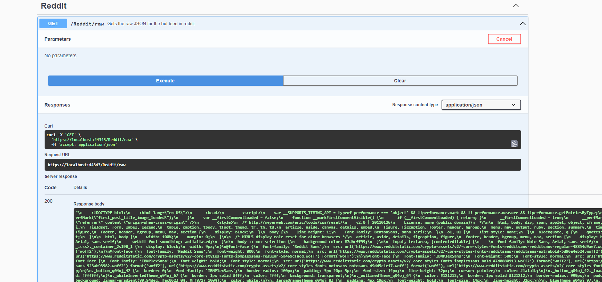

# Calling APIs

So sometimes, our API relies on data from another API to do the work that it needs to get done. In fact, most of the time, APIs we create often rely on many other APIs, and we call them "dependencies". This is what we call a microservices architecture pattern.

To call other APIs, we need to be able to not only send HTTP requests by interacting with the browser UI, but we also need to be able to send them via code to get the data we need.

## HttpClient

HttpClient is the base client in C# for calling other APIs - it is the class we will be using to make some API requests of our own. Let's start by calling Reddit API!

### Defining the HttpClient

The HttpClient is something that we can dependency inject into our controllers. We can do this by adding the following line to our Startup.cs file:

```c#
services.AddHttpClient("reddit", configureClient: client =>
{
    client.BaseAddress = new Uri("https://www.reddit.com/dev/api");
});
```

This will add a new HttpClient to our services collection, with the name "reddit". This HttpClient will have a base address of "https://www.reddit.com/dev/api".

### Using the HttpClient

To use the HttpClient, let's take a look at the following code in `ReditController`:

```c#
[ApiController]
[Route("[controller]")]
public class RedditController : ControllerBase
{
    private readonly HttpClient _client;
    /// <summary />
    public RedditController(IHttpClientFactory clientFactory)
    {
        if (clientFactory is null)
        {
            throw new ArgumentNullException(nameof(clientFactory));
        }
        _client = clientFactory.CreateClient("reddit");
    }
    /// <summary>
    /// Gets the raw JSON for the hot feed in reddit
    /// </summary>
    /// <returns>A JSON object representing the hot feed in reddit</returns>
    [HttpGet]
    [Route("raw")]
    [ProducesResponseType(200)]
    public async Task<IActionResult> GetRawRedditHotPosts()
    {
        var res = await _client.GetAsync("/hot");
        var content = await res.Content.ReadAsStringAsync();
        return Ok(content);
    }
}
```

The first part of the controller is the constructor. Notice how we take in an IHttpClientFactory, and then we create a new HttpClient, specifying that we want the reddit client by name. This allows us to get the correct HttpClient that has been configured in the middleware for what we want to retrieve.

The second part is the method call itself. We pass in an additional string, "/hot", which defines the actual API endpoint we are trying to hit from reddit itself.

If we run this code up, and then take a look at the result:

  

We get a response from the reddit API!

## Summary

To call APIs, we need to be able to send HTTP requests to them by using an `HttpClient` instance, which we have defined. In the [next module](https://github.com/NZMSA/2022-Phase-2/tree/main/2.%20Backend/App%20Configuration/Readme.md), we will learn how to use the application configuration to configure the HttpClient.