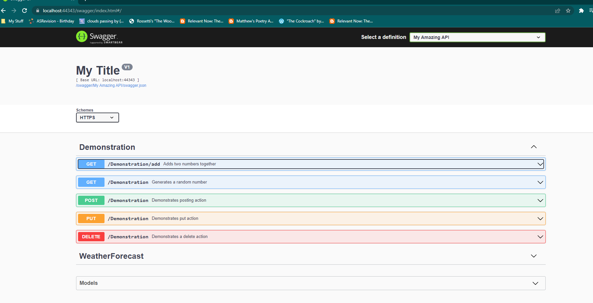
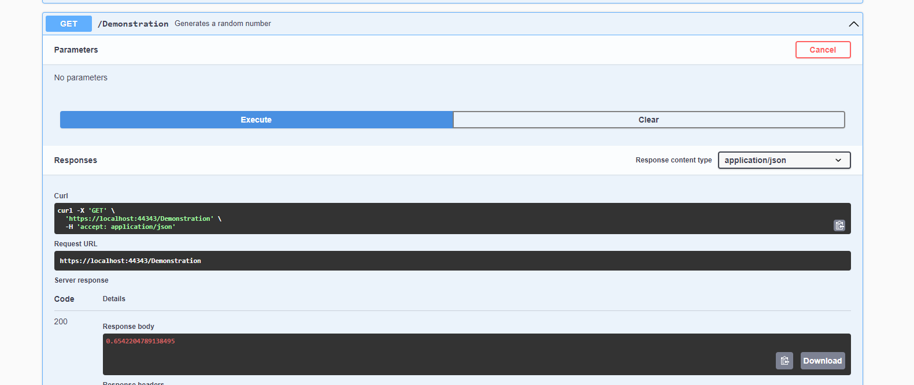
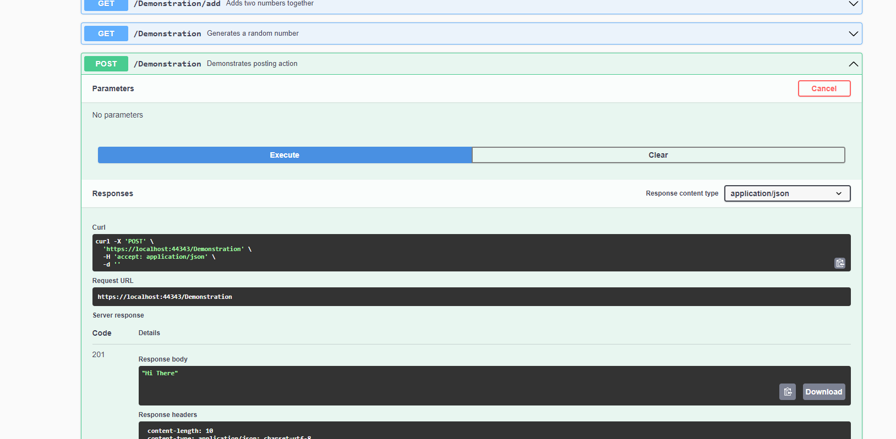
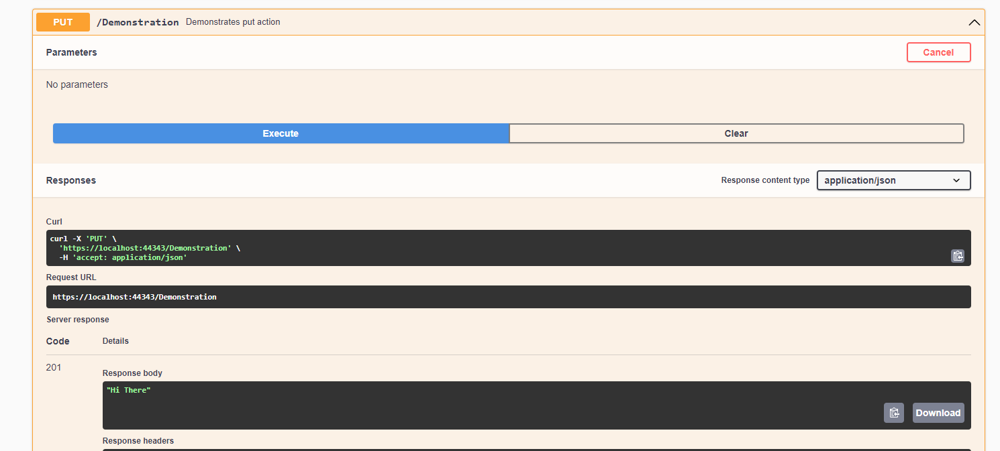
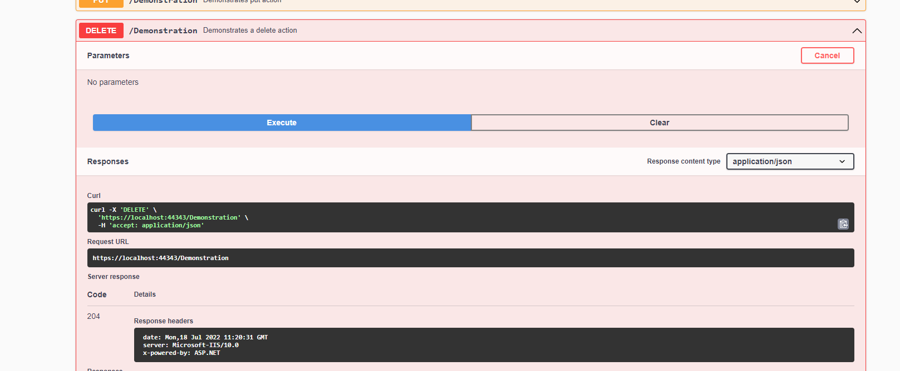

# Creating Controllers

Controllers are what we use to define the `contract` for our API. For example, in the template project, you have already seen the weather forecast controller. It defines a single get endpoint, `/weatherforecast`, which returns a list of weather forecasts.

Let's get started by creating our own controller, and defining some behaviour.

## Creating a New Controller

Start by creating a new cs file in the Controllers folder, which we can call `DemonstrationController.cs`. In that file, replace it's contents with the following code:

```c#
using Microsoft.AspNetCore.Mvc;
using System;

namespace MSA.Phase2.AmazingApi.Controllers
{

    [ApiController]
    [Route("[controller]")]
    public class DemonstrationController : ControllerBase
    {
     
        /// <summary>
        /// Adds two numbers together
        /// </summary>
        /// <param name="left">The number on the left, which must be a positive integer</param>
        /// <param name="right">The number on the right, which must be a positive integer</param>
        /// <returns>The sum of the input numbers</returns>
        [HttpGet]
        [Route("add")]
        [ProducesResponseType(200)]
        [ProducesResponseType(400)]
        public IActionResult GetSum(int left, int right)
        {
            if (left < 0 || right < 0) return BadRequest("The inputs must be greater than zero");

            return Ok(left + right);
        }

        /// <summary>
        /// Generates a random number
        /// </summary>
        /// <returns>A random number</returns>
        [HttpGet]
        [ProducesResponseType(200)]
        public IActionResult GetNumber()
        {
            return Ok(new Random().NextDouble());
        }

        /// <summary>
        /// Demonstrates posting action
        /// </summary>
        /// <returns>A 201 Created response</returns>
        [HttpPost]
        [ProducesResponseType(201)]
        public IActionResult DemonstratePost()
        {
            Console.WriteLine("I'm doing some work right now to create a new thing...");

            return Created(new Uri("https://www.google.com"), "Hi There");
        }

        /// <summary>
        /// Demonstrates put action
        /// </summary>
        /// <returns>A 201 Created Response></returns>
        [HttpPut]
        [ProducesResponseType(201)]
        public IActionResult DemonstratePut()
        {
            Console.WriteLine("I'm over-writing whatever was there in the first place...");

            return Created(new Uri("https://www.google.com"), "Hi There");
        }

        /// <summary>
        /// Demonstrates a delete action
        /// </summary>
        /// <returns>A 204 No Content Response</returns>
        [HttpDelete]
        [ProducesResponseType(204)]
        public IActionResult DemonstrateDelete()
        {
            Console.WriteLine("I'm removing something from the database...");

            return NoContent();
        }
    }
}
```

I know this is a lot to take in at once, so let's run it up. Once you do so, you should see the following:

  

Let's break this down a bit.

## CRUD Operations

CRUD stands for Create, Read, Update, and Delete. Each of these operations is a method on the controller.

### Read

Read is represented by the get command, and generally represents fetching some data from the API. This is usually returned in the response. For example, let's try to get a random number:



Our HTTP response code is 200, which is OK, and we've been returned a number which represents the object that we've gotten.

### Create

Create is represented by the post command, and generally takes in an argument of some sort. This usually is followed by a response, which is usually a 201 Created response. For example, our post command returns:

  

### Update

Update is represented by a put command, and is very similar to post. The difference is between the behaviour: post is generally used to create new objects but will not overwrite existing objects, while put will overwrite existing objects as well. Our put command returns:

 

### Delete

Delete is represented by a delete command, and generally takes in an argument of some sort. This usually is followed by a response, which is usually a 204 No Content response. For example, our delete command returns:

  

## HTTP Response Codes

As we saw in the examples above, each controller method returned a different response code. This is because each response code represents a different status of what the API did while functioning. For a full list of all the HTTP response codes, look [here](https://developer.mozilla.org/en-US/docs/Web/HTTP/Status).

## Controller Code

Looking at the controller code, we can see that we've defined a number of methods. Each of these methods has some attributes defining a few things about it. For example, let's look at the GetSum method:

```c#
/// <summary>
/// Adds two numbers together
/// </summary>
/// <param name="left">The number on the left, which must be a positivinteger</param>
/// <param name="right">The number on the right, which must be a positivinteger</param>
/// <returns>The sum of the input numbers</returns>
[HttpGet]
[Route("add")]
[ProducesResponseType(200)]
[ProducesResponseType(400)]
public IActionResult GetSum(int left, int right)
{
    if (left < 0 || right < 0) return BadRequest("The inputs must be greatethan zero")
    return Ok(left + right);
}
```

There are a few things to note: The comment above the method describes the method contract - what it does. In this case, we take 2 positive numbers as inputs, and add them together. We return a 200 OK response, as well as the sum of the input numbers.

As for the attributes, we have a number of them. The first is the HttpGet attribute, which tells the API that this method is a GET request. The second is the Route attribute, which tells the API what the URL should be for this method. The third is the ProducesResponseType attribute, which tells the API what the response code should be for this method. There can be multiple response codes, as the API has to return different response codes based on the inputs - here, we return a Bad Request 400 response if either input is negative!

### Summary

This should hopefully get you started on creating your own controllers, and creating your own methods and interacting with them through the Swagger UI. The next module is on calling other APIs, and you can find it [here](https://github.com/NZMSA/2022-Phase-2/tree/main/2.%20Backend/Calling%20APIs/Readme.md)