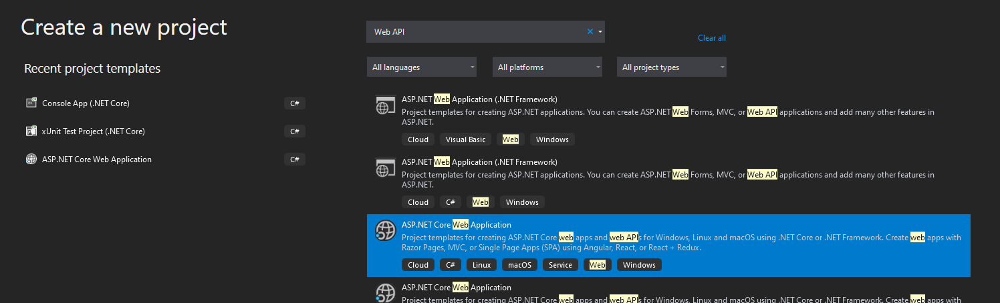
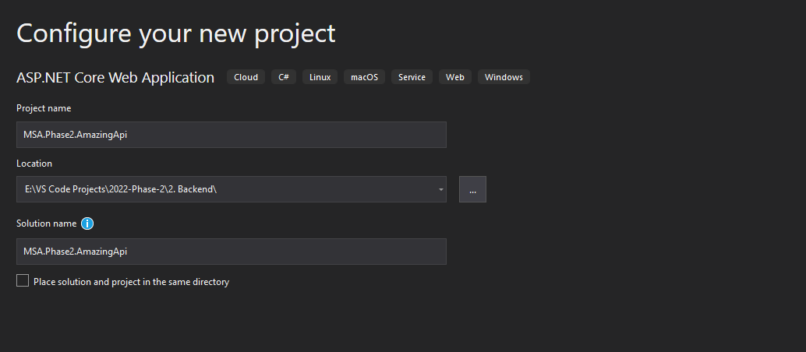
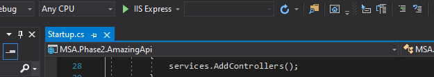

# Getting Started :rocket:

To begin, you will need the following tools from phase 1:
- [Visual Studio](https://visualstudio.microsoft.com/downloads/)
- [.NET 6.0 SDK](https://dotnet.microsoft.com/en-us/download/dotnet/6.0)

## Initialising a new project

We will start by creating a new project in Visual Studio with the following settings:
  

Give your project a suitable name, and click on the "Create" button:
  

Click the play button in the top:

  

You should see the following browser window open:

  

You've succefully initialised a new Web API project! However, in this form, it's not very pretty nor very useful to you. We're going to do something about that in the [next module](https://github.com/NZMSA/2022-Phase-2/tree/main/2.%20Backend/Swagger/Readme.md)