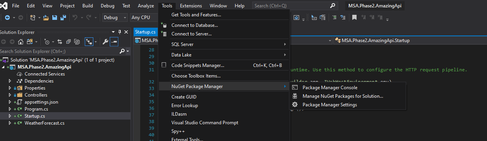
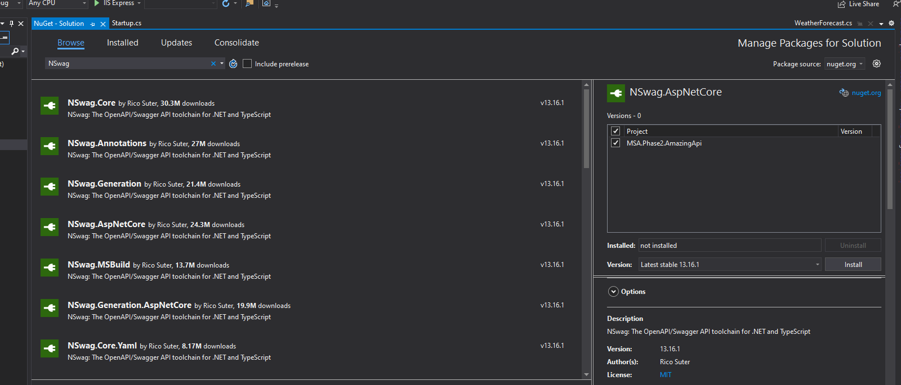
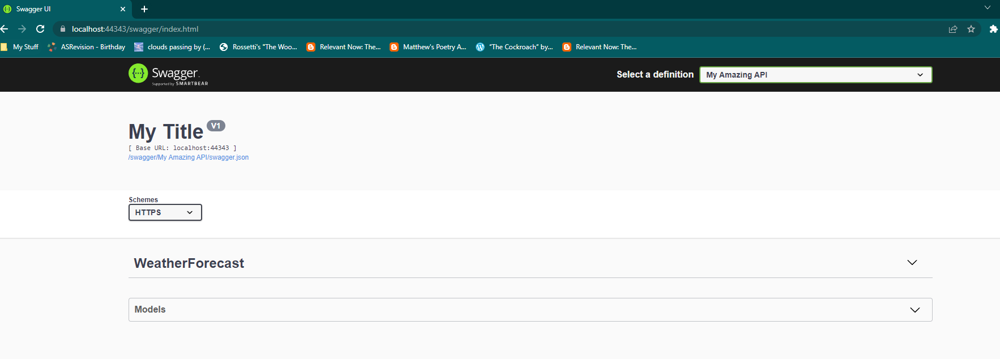
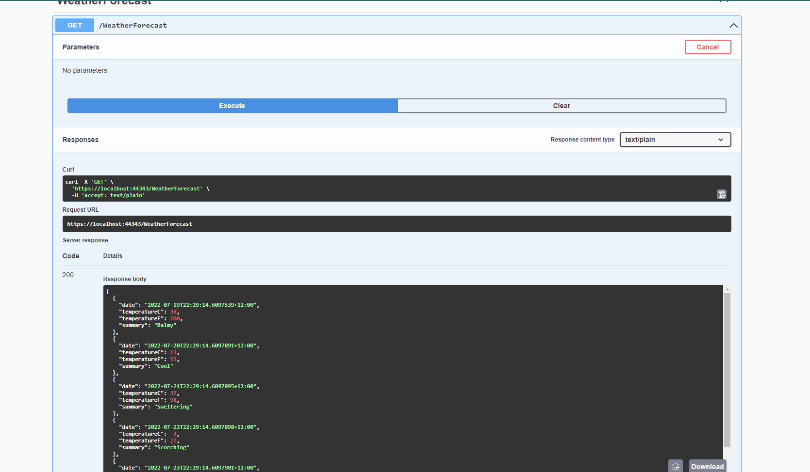
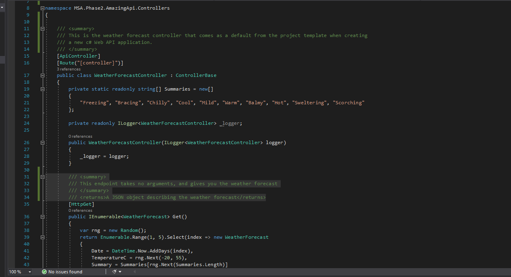
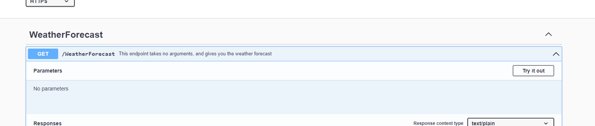

# Swagger

What is Swagger? Swagger is an open source implementation of an open specification for describing RESTful APIs. This means that the specification is maintained by a community of developers, who are dedicated to making the specification as useful to you as possible (and as easy to use as possible, mostly for themselves!).

---

## Adding Swagger

### Installing the Package

We can add Swagger to our project by first navigating to the Nuget package manager here:



We then want to search for `NSwag.AspNetCore` in the search bar under the **Browse** tab, and click "Install":



---
### Configuring Swagger

Navigate to `Startup.cs` in your Solution Explorer, and add the following lines of code to the `ConfigureServices` method:

```c#

services.AddSwaggerDocument(options =>
{
    options.DocumentName = "My Amazing API";
    options.Version = "V1";

});
```

This code does a couple of things:
1. It adds the NSwag middleware into your application middleware pipeline
2. It configures this middleware to have a document name of `"My Amazing API"` and a version of `"V1"`

However, if you run the project up now, you will notice that nothing has changed. What gives? To understand that, we need to understand how middleware works. In C#, middleware is a collection of services that are configured to be running in the application when it starts up, before any of your own code actually runs - you can think of them as helpers to make your life easier, and to keep your code neater.

This is what the `ConfigureServices()` method is actually doing - it is setting up these middleware classes to be used by the application that is about to start.
        
Now, to actually see your changes, we will also need to add some code to the `Configure()` method in this file as well. Add the following code into the `Configure()` method:

```c#
    app.UseOpenApi();
    app.UseSwaggerUi3();
```

This code does two things:
1. It adds configures the application to run an OpenAPI specification generator when it first starts up
2. It adds the Swagger UI to the application, so that you can view the API documentation from a web browser.

The `Configure()` method is used to configure what the API application will do when it is started - this is convenient as it allows us to define a lot of the behaviour of the application in one place, outside of our own code.

Running the code up, you should see the following at the /swagger endpoint:


Clicking through the WeatherForecast endpoint documentation, and down into the GET method, you should be able to click __Try it out__ and then __Execute__. This should give you the following response:

  

---

### Adding Documentation

Now let's add some documentation to the weather forecast controller. Add the following comment to the top of the `WeatherForecastController.cs` in the Controllers folder:

```c#
    /// <summary>
    /// This is the weather forecast controller that comes as a default from the project template when creating
    /// a new c# Web API application.
    /// </summary>
```
While we're here, let's also add this comment to the method in the controller:

```c#
    /// <summary>
    /// This endpoint takes no arguments, and gives you the weather forecast
    /// </summary>
    /// <returns>A JSON object describing the weather forecast</returns>
```

Your `WeatherForecastController` file should look something like this:

  

We also need to add the following XML comment to the csproj file:

```c#
  <PropertyGroup>
    <GenerateDocumentationFile>True</GenerateDocumentationFile>
  </PropertyGroup>
```

Loading it back up, you should see the following:
  

Our in-code comment has generated documentation for the endpoint in the API!

---

### Summary

Hopefully, that gives you a bit of an overview of how the middleware configuration in a .NET Web API works, as well as how we use middleware tools to make our API code more readable and easier to maintain. In the [next section](https://github.com/NZMSA/2022-Phase-2/tree/main/2.%20Backend/Creating%20Controllers/Readme.md), we will cover how to create our own controllers.