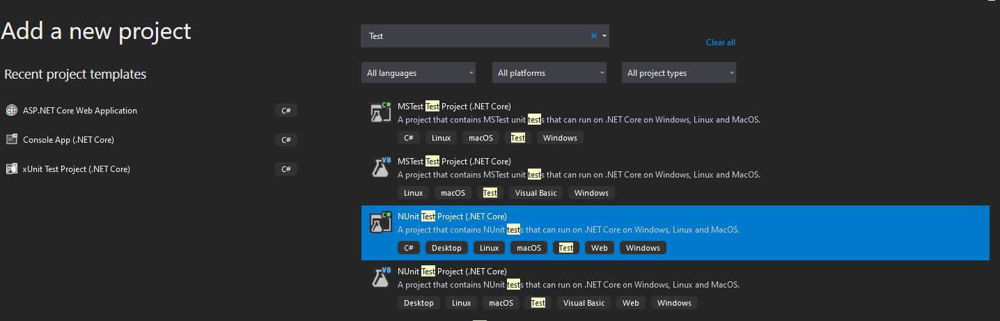
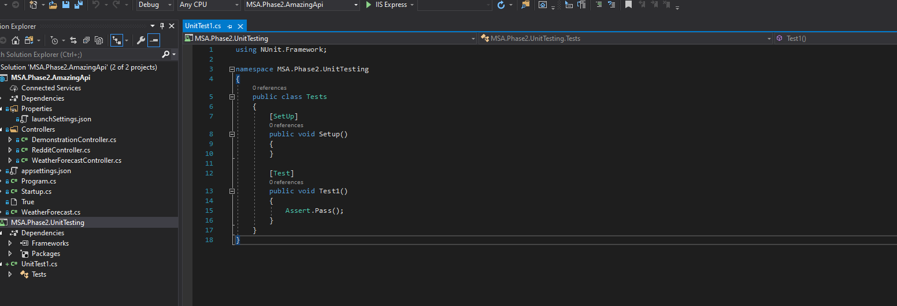
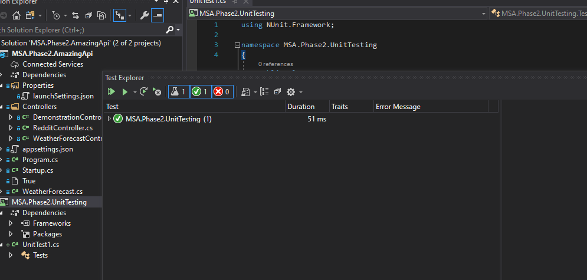

# Unit Testing

What even is unit testing? Unit testing is the process of testing a single unit of code. This is done by writing a test that verifies that a single unit of code works as expected.

Let's start by setting up a simple test project to verify that our dummy controller is working as expected.

---

## Setup

Start by creating a new project in the existing solution by doing the following:

  

Then you want to add an NUnit test project:

  

You should then see the following contents in the project:

  

And by clicking run tests:

  

Horray! The default test in the project passes. Happy testing!

## Additional Reading

If you want to learn more about how to test in depth, here are some links to some great libraries and documentation for how to unit test:

- [Nunit](https://www.nuget.org/packages/NUnit.Runners/)
- [FluentAssertions](https://fluentassertions.com/)
- [NSubstitute](https://nsubstitute.github.io/)
